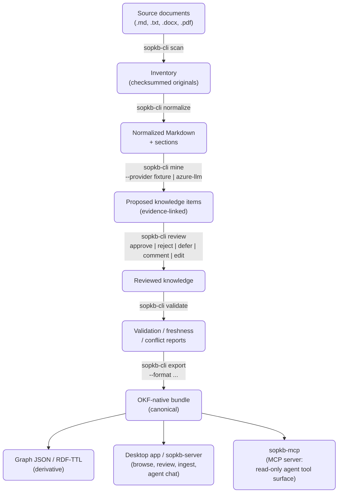

# Architecture Overview

This is a short, public-facing tour of how KL4A fits together. For full detail — the product requirements, the implementation design, and the normative bundle spec — see the deeper docs linked at the end of each section; this page intentionally does not duplicate them.

## The shape of the system

??? note "Diagram as a linear list (for screen readers, or if you copied the diagram's text)"
    Copying text out of a Mermaid diagram (or reading it with a screen reader) pulls out node labels and edge labels as two separate groups, not in visual reading order. Here's the same pipeline top to bottom:

    1. **source documents** (.md, .txt, .docx, .pdf)
    2. → `sopkb-cli scan` → **inventory** (checksummed originals)
    3. → `sopkb-cli normalize` → **normalized Markdown + sections**
    4. → `sopkb-cli mine --provider fixture|azure-llm` → **proposed knowledge items** (evidence-linked)
    5. → `sopkb-cli review` → **reviewed knowledge**
    6. → `sopkb-cli validate` → **validation / freshness / conflict reports**
    7. → `sopkb-cli export --format ...` → **OKF-native bundle** (canonical), which then feeds three things in parallel:
        - **Graph JSON / RDF-TTL** (derivative)
        - the desktop app, or `sopkb-server` for a browser-based deployment (browse, review, ingest, agent chat)
        - `sopkb-mcp` (MCP server: read-only agent tool surface)

!!! note "No database. Network calls depend on which surface you use, and which provider it defaults to."
    Everything left of `sopkb-server`/`sopkb-mcp` is implemented as a plain CLI pipeline over files on disk — there is no database anywhere in this path. Whether a network call happens depends on the mining/agent provider, and **both surfaces lean toward the network-dependent path by default**:

    - **CLI** (`sopkb-cli mine`, no `--provider` given): defaults to `azure-llm` — it calls Azure OpenAI. Pass `--provider fixture` for a zero-dependency, offline run. (`sopkb-cli normalize` is the exception: it does default to `fixture`.)
    - **Desktop app's Ingest sources screen**: the **Mining provider** dropdown defaults to `azure-llm` once a default LLM profile is configured on the Settings screen; with no profile configured it stays on `fixture`. Both fail closed (they error rather than silently proceeding) if the profile's credentials aren't set, so there's no silent leak absent configuration.

    Pick `fixture` explicitly (CLI flag or dropdown) for a fully offline run.

## Bundle store

A **SOP Knowledge Bundle** is a directory created by `sopkb-cli init`: a fixed set of subdirectories (`sources/`, `sections/`, `concepts/`, `knowledge/`, `relations/`, `rules/`, `evidence/`, `tasks/`, `references/`, `authored/`, `reports/`) plus a `manifest.yaml`.

The bundle root itself is the canonical, OKF-compliant artifact — Markdown documents with YAML frontmatter, cross-linked to each other.

A `.sopkb/` subdirectory holds implementation state (JSON indexes, upload staging, caches) that is derived from, and re-synced into, the canonical Markdown on every mutating command.

→ Full normative shape: [`OKF_BUNDLE_SPEC.md`](OKF_BUNDLE_SPEC.md).

## Mining / extraction

`sopkb-cli mine` turns normalized section text into **proposed knowledge items**, each an evidence-linked subject/predicate/object claim with a source span, confidence score, and `review_status: proposed`. Two providers exist today:

| Provider | Default | Implementation | Dependencies / network | Behavior |
|---|---|---|---|---|
| `fixture` | Opt-in on the CLI (`--provider fixture`); in the desktop app's Ingest sources screen it's what the dropdown falls back to when no LLM profile is configured. | `v2/sopkb-rust/crates/sopkb-mining/src/mine_fixture.rs` | Zero dependencies, deterministic, offline | Regex-based obligation-sentence detection |
| `azure-llm` | Yes on the CLI (`sopkb-cli mine`'s `--provider` default), and in the desktop app's Ingest sources screen once an LLM profile is configured on the Settings screen. | `v2/sopkb-rust/crates/sopkb-mining/src/okf_author.rs` | Azure OpenAI's Responses API | LLM-authored path that also emits full OKF documents (concepts, decision rules) alongside knowledge items |

Both write the same underlying `KnowledgeItem` shape, so downstream review, export, and agent consumption are provider-agnostic.

This mining-provider axis is unrelated to how the desktop app's **Agent** screen evaluates a scenario against already-mined knowledge — that's a separate call, not a user-facing provider choice, and not how knowledge is *extracted*. See [DESKTOP_UI_GUIDE.md](DESKTOP_UI_GUIDE.md#agent).

## Review

Human-in-the-loop review (`sopkb-cli review`, or the Review panel on the desktop app's Knowledge screen) is first-class, not a preview feature: approve, reject, defer, comment, and edit actions are all persisted as review events with reviewer identity and rationale (`v2/sopkb-rust/crates/sopkb-review/src/review.rs`). Approved and rejected are terminal states. Review state flows directly into validation reports and into `has_review` edges in graph exports — there's no separate publish step.

## Export

`sopkb-cli export` re-syncs the canonical OKF bundle and additionally writes derivative formats — Graph JSON and RDF/Turtle — under a sibling `exports/` directory (`v2/sopkb-rust/crates/sopkb-export/src/bundle_export.rs`, with `graph.rs` and `rdf.rs` for the derivative formats). The OKF bundle itself never requires "exporting" to be useful; these are additional representations for graph tooling and the enterprise import path.

## Web server and MCP server

The desktop app is the primary UI and calls these crates directly through Tauri commands — no HTTP, no sidecar process. For a browser-based deployment there's `sopkb-server` (`v2/sopkb-rust/bin/sopkb-server`), an axum app that serves the same frontend plus the full pipeline, review, and agent chat over HTTP — bound to `127.0.0.1:4173` by default and gated behind a generated token. `sopkb-mcp` (`v2/sopkb-rust/bin/sopkb-mcp`) — a standalone binary, not a `sopkb-cli` subcommand — exposes a read-only-by-default Model Context Protocol tool surface (bundle/sources/sections/knowledge/evidence/conflicts/freshness/citations/agent/relations) over JSON-RPC/stdio, with an explicit `--enable-review-notes` opt-in for the one mutating tool.

→ Desktop app screens: [`DESKTOP_UI_GUIDE.md`](DESKTOP_UI_GUIDE.md). → MCP server: [`MCP_SERVER.md`](MCP_SERVER.md).

## Agent consumption

The `sopkb-agent` crate (`v2/sopkb-rust/crates/sopkb-agent`) provides task-scoped context retrieval (`agent.context`, `agent.tasks`, `agent.guide`) and RDF-compatible relation traversal (`relations.search`, `relations.neighborhood`), usable identically from the CLI, the desktop app's Agent screen, or MCP. So an agent gets the same evidence-grounded, review-aware context regardless of integration surface.

## Where this stops

!!! note "Out of scope"
    This project owns bundle **creation and export**. It does not implement multi-tenant governance, RBAC, audit trails, or hosted APIs at organizational scale — that boundary, and why it's drawn there, is covered in [Governance](GOVERNANCE.md).

## Further reading

- [`OKF_BUNDLE_SPEC.md`](OKF_BUNDLE_SPEC.md) — the normative bundle shape.
