# Desktop UI Guide

This guide walks through every screen of the KL4A Workbench desktop app. It's a Tauri v2
native shell: a React single-page app talks directly, in-process, to a Rust command layer —
no HTTP server, no sidecar process, no separate runtime to install. See the
[Quickstart](quickstart.md) for how to get the app.

!!! note "About the images below"
    All but one are real screenshots of the app running against the `examples/glp1-healthcare`
    bundle. Only the Degraded recovery screen is still an illustrative wireframe, not a real
    screenshot — labeled as such. Swap it for a real capture whenever convenient: drop a PNG
    named `degraded.png` into `images/desktop-ui/` and update the reference below.

## Getting started

Launch the built executable directly. With no arguments, it opens a `SOP Knowledge Workbench` folder in your home
directory, created automatically if it doesn't exist yet — that's the on-disk default
folder name; the app's own UI is branded KL4A Workbench throughout. To point it at a
different folder instead, either pass the folder as the first command-line argument or set
the `SOPKB_BUNDLE_DIR` environment variable before launching.

A **workbench root** is any folder whose `knowledge-bundles/` subdirectory holds one or more
bundles. The app always opens at the **Bundles** screen for that root; picking (or creating)
a bundle there is how you get into everything else.

## Layout

Every screen shares the same frame: a left sidebar and a main content area to its right.

The sidebar has four parts, top to bottom:

- A header with the app mark and, once a workbench root is open, whether it's in
  single-bundle or multi-bundle mode.
- **Overview**, pinned above everything else once a bundle is selected — it's the bundle's
  dashboard, not a workflow step, so it doesn't belong to any of the phase groups below it.
- The rest of the bundle-scoped navigation, grouped by workflow phase — **Build** (Ingest,
  Sources), **Understand** (Knowledge, Concepts), **Govern** (Agent) — scrollable
  independently of the rest of the sidebar.
- **Bundles** and **Settings**, pinned to the bottom behind a divider, always visible
  regardless of whether a bundle is open.

| Screen | What it's for |
|---|---|
| [Bundles](#bundles) | Every bundle in this workbench root, create/open/delete |
| [Overview](#overview) | Bundle stats at a glance, plus the full set of generated reports |
| [Ingest sources](#ingest-sources) | Run scan → normalize → mine → validate on a folder or uploaded files |
| [Sources](#sources) | Every ingested document, its parse health, and per-source actions |
| [Knowledge](#knowledge) | Browse or search every mined knowledge item, with section coverage |
| [Concepts](#concepts) | Every entity knowledge has been resolved into |
| [Agent](#agent) | Chat against the bundle's knowledge and decision rules, with per-chat memory |
| [Settings](#settings) | LLM provider profiles, prompts, MCP wiring, diagnostics — not bundle-scoped |

Two more screens are reached only by drilling into something above, not from the sidebar:
a source's detail view (from Sources) and a knowledge item's review view (from Knowledge,
Sources, or Concepts).

## Bundles

The landing screen for a workbench root: every bundle found under `knowledge-bundles/`, as
cards in a grid (toggle to a list view; both choices, plus your last sort mode, persist
between launches). Each card shows the bundle's title, source count, knowledge-item count,
and status, with **Open** and **Delete**. Sort by folder name, title, or creation date (newest
first by default), either direction.

Above the grid: a field to type a different workbench root path (**Switch**) or pick one with
a native folder dialog (**Browse…**), and a field to create a new bundle by title.

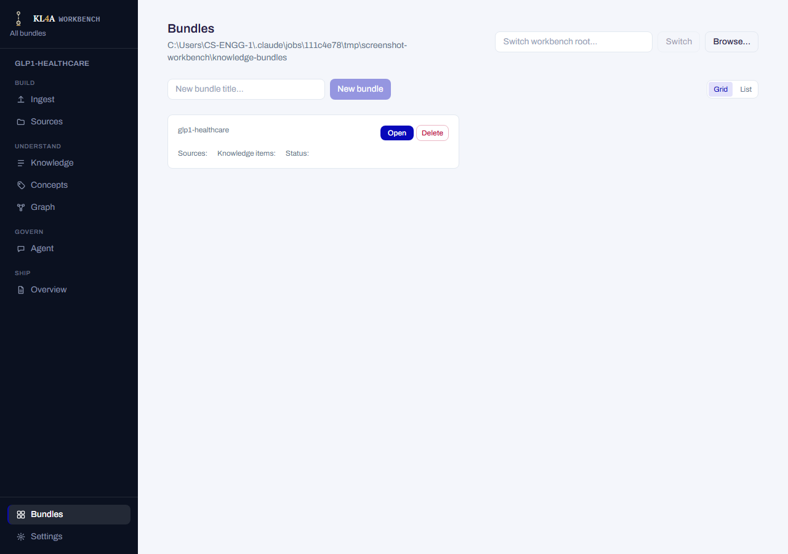

!!! warning "Deleting a bundle is permanent"
    The confirmation dialog requires typing the bundle's exact title to proceed, and says so
    plainly: this deletes the bundle and everything in it — sources, knowledge items,
    reviews, exports — and cannot be undone.

A bundle that failed to load shows its error inline on the card instead of an Open button,
rather than silently disappearing from the list.

## Ingest sources

Runs the ingestion pipeline — scan, normalize, mine, validate — against a folder or files you
supply from inside the app.

- **Source** — **Pick files…** / **Pick folder…** (native pickers) or drop in a **fallback
  source folder path**; picking a folder overrides any staged files for that run entirely.
  Supports `.md`, `.txt`, `.docx`, `.pdf`.
- **Pipeline steps** — four checkboxes, each labeled with exactly what it does: *Scan*, *
  Normalize (wipes normalized text first)*, *Mine (rewrites items.json — invalidates existing
  reviews)*, *Validate*. Steps the last run already completed successfully come pre-unchecked,
  with a note explaining why — you can always recheck them.
- **Mining provider** — a dropdown of whatever LLM profiles are configured in Settings, plus
  `fixture` as a zero-dependency offline option.
- **Preview source changes** shows what would change without requiring confirmation;
  **Run pipeline** is gated behind an explicit confirmation checkbox in addition to picking at
  least one step. A run can be cancelled mid-flight (cooperatively — it finishes its current
  step first).
- **Result** — stat tiles for whatever actually ran: files uploaded, sources scanned, sections
  normalized, items mined, validation errors/warnings.

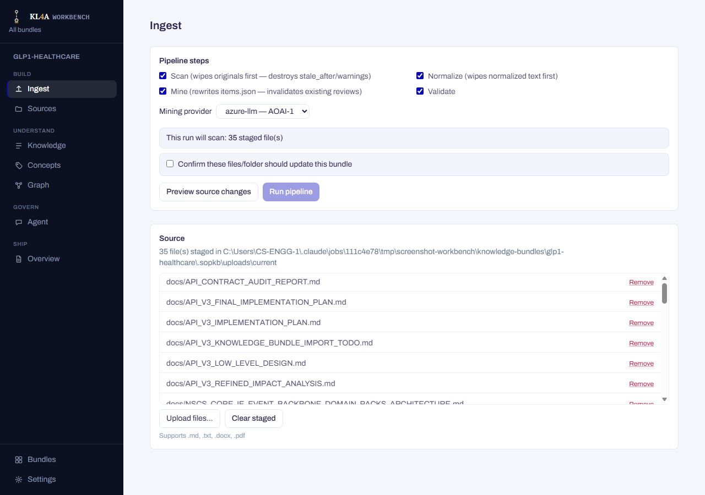

!!! warning "Scan, Normalize, and Mine each discard prior state for what they touch"
    Scan wipes each source's recorded state before rescanning it; Normalize wipes normalized
    text before re-deriving it; Mine rewrites the bundle's knowledge items and invalidates
    existing reviews on them. This is why **Run pipeline** needs its own confirmation
    checkbox, separate from just selecting steps.

## Sources

Every source document ingested into the bundle, with parse health and management actions.
**Reveal bundle folder** opens the bundle's directory on disk; **Force resync** re-derives the
OKF bundle without a full ingest run. A banner links to the Ingest screen while a run is in
progress, or summarizes the last run's result when it's not.

The table: title (with a **Retired** chip if applicable), type, parse status, size, warning
count, section count, and per-row actions — **View** (opens the source's detail screen),
**View run** (jumps to the ingest run that produced it), **Retire**.

A section count of exactly 1 is flagged, because it usually means the source's text never
split on real headings and became one undifferentiated section — a real signal worth
checking, not a cosmetic warning.

Retiring a source is explained plainly in its own confirmation dialog: the original file,
normalized text, and evidence all stay on disk, and any still-active knowledge items mined
from it just stop appearing in the default agent context. There's no un-retire button yet,
but nothing is deleted.

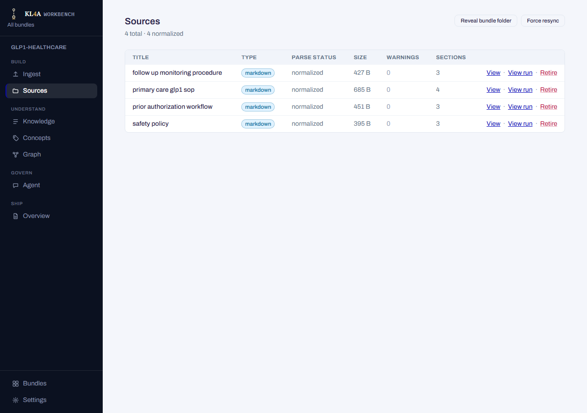

### Source detail

Opened from a Sources row. The source's normalized text on the left (truncated by default,
with a toggle to show it in full), its section table of contents on the right, and below
both, every knowledge item mined from this source with a link into that item's review.

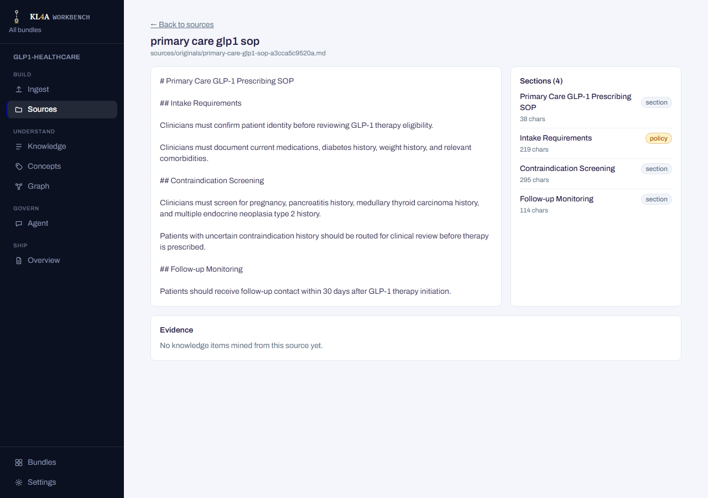

## Knowledge

Every mined knowledge item in the bundle, searchable across subject, predicate, object, or
source text. A coverage bar up top shows what fraction of the bundle's sections have at least
one knowledge item, with a list of any sections that still have none.

The results table shows subject, predicate, object (truncated, full text on hover), review
status, a confidence meter, and a link into that item's review. Search hits show fewer fields
than the full list (no confidence, source text shown as "evidence" instead) since search
results come from a different, lighter-weight lookup.

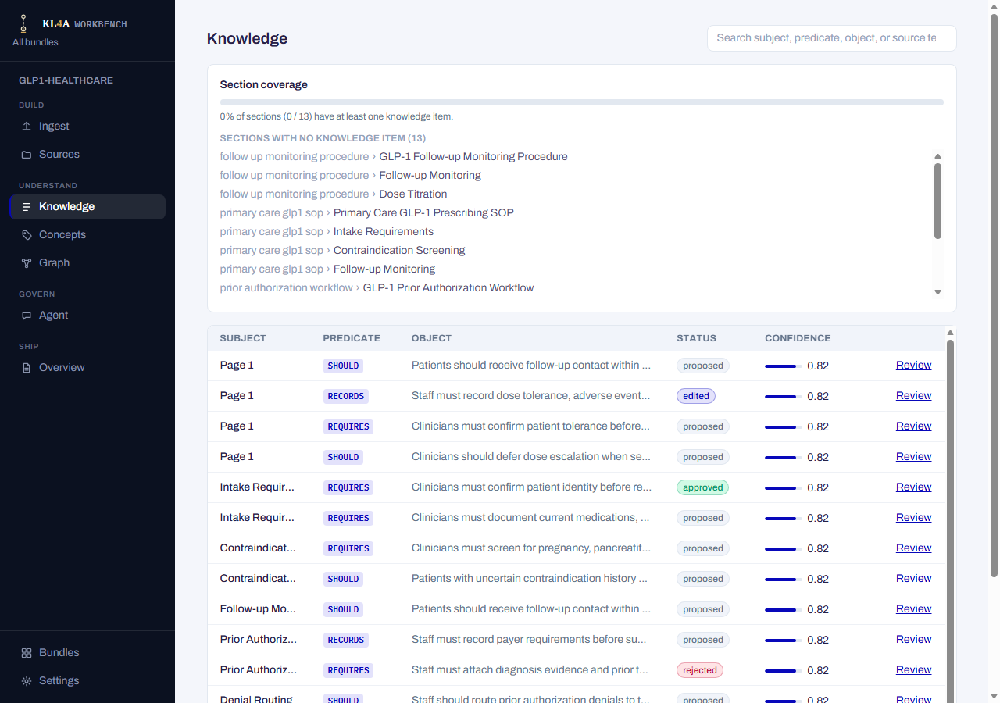

### Review

Opened from any knowledge item — Knowledge, Sources, or Concepts. The full item:
subject, predicate, confidence, object, and source text, each individually editable; the
relation as a plain sentence; any decision rules that apply; and the review actions —
**Approve**, **Reject**, **Defer**, **Comment** — each requiring a short rationale, with every
past action listed below as an immutable history (reviewer, timestamp, rationale).

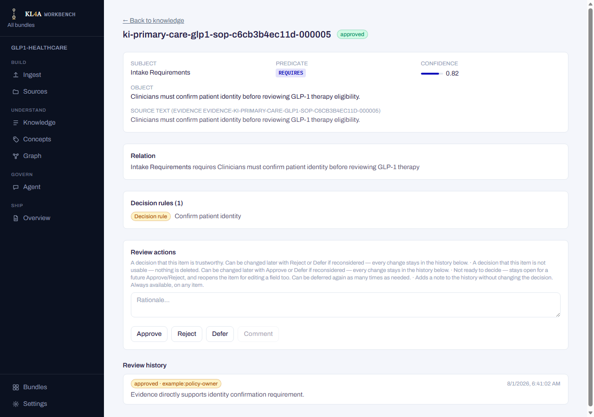

!!! note "Review decisions can be changed at any time"
    Approving, rejecting, or deferring an item is never final — you can move it between those
    three states as many times as you need to, and every change is kept in the history below
    rather than overwriting it. Editing a field's value is the one action that stays locked
    once an item is approved or rejected; defer it first to reopen editing.

## Concepts

Every concept — entity — the bundle's knowledge has been resolved into, as a grid of cards.
Each card shows the concept's label, how many knowledge items and decision rules reference
it, and a small pill per review status present among those items (e.g. "approved: 4").

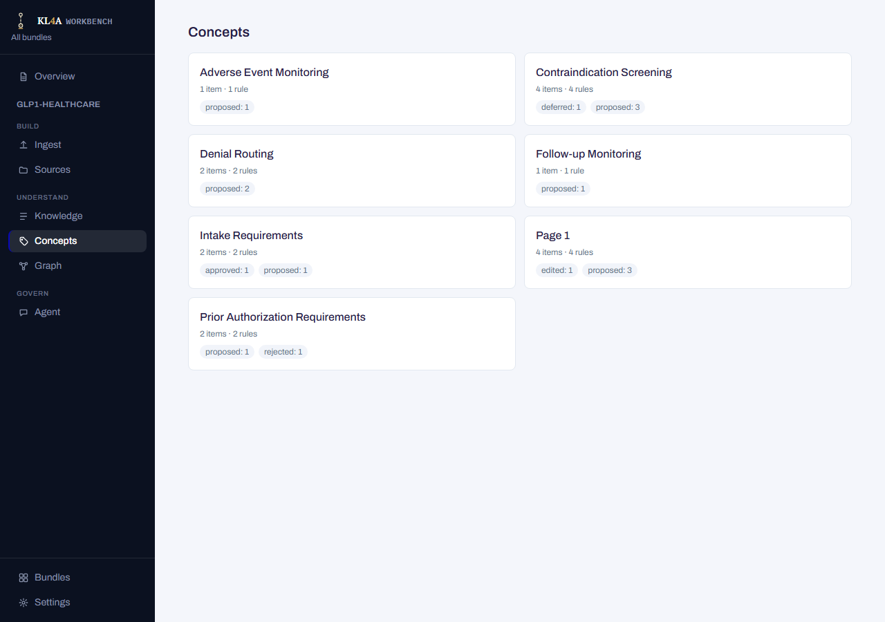

### Concept detail

Opened from a Concepts card: every knowledge item tied to this concept (with a review link
each) and every decision rule that applies to it.

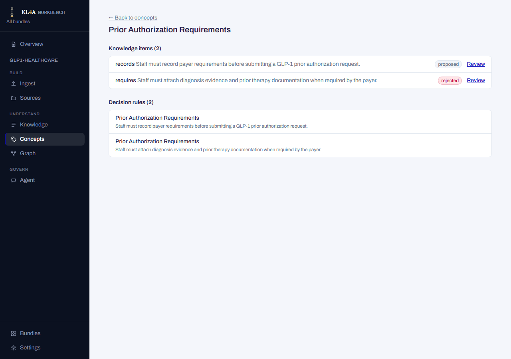

## Agent

A chat interface for asking scenario questions against the bundle's knowledge and decision
rules, with separate, persisted chats and a choice of answer providers.

- A left rail lists your chats (newest active first, titled from each chat's first question),
  with **+ New chat** and, once you have any history, **Clear all chat history**.
- Each response shows which provider answered, a summary of how many knowledge items/concepts
  were used, and — for the tool-using provider — a collapsible trace of what it looked up
  before answering.
- **Task context** pins which predefined scenario the next question draws from ("Auto" matches
  it automatically).
- The composer has a **Provider** dropdown — `context` (no LLM call), `azure-llm`, or
  `azure-llm` with tool lookups — and a checkbox, **"Allow proposed/draft knowledge in the
  answer"**.

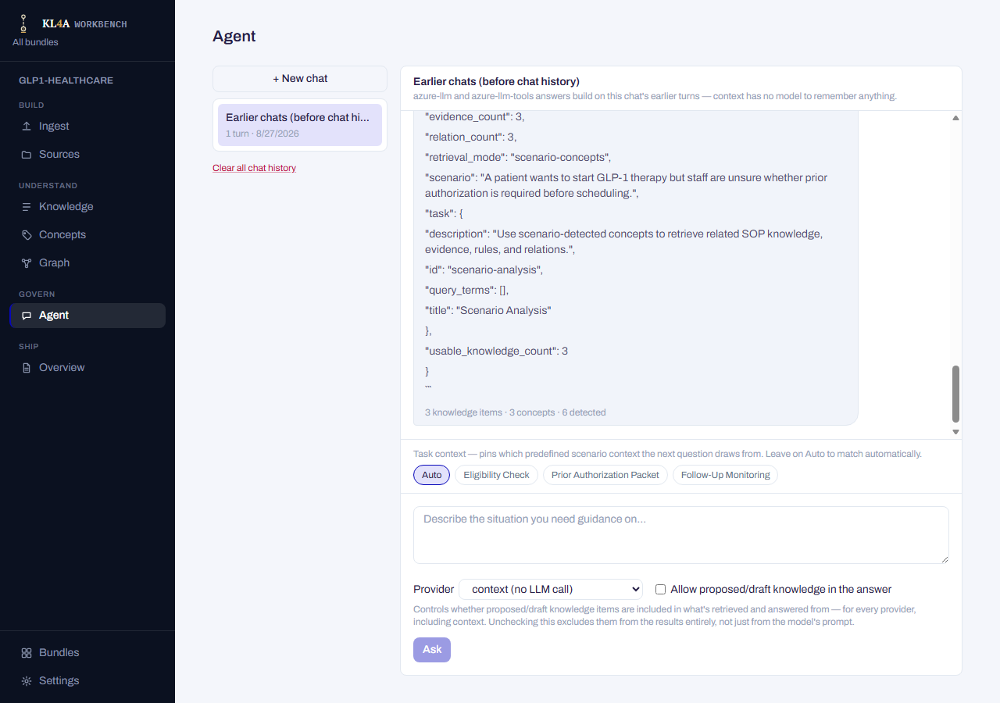

!!! note "The proposed-knowledge checkbox is a real filter, not a suggestion"
    Unchecking it excludes proposed/draft items from what's retrieved and answered from
    entirely, for every provider — not just a hint passed to the model. Leave it unchecked
    (the default) to keep answers grounded only in reviewed knowledge.

!!! warning "Clearing chat history is bundle-wide"
    **Clear all chat history** deletes every chat's turns, not just the one you're currently
    viewing, and can't be recovered.

## Overview

The bundle's landing dashboard — pinned at the very top of the sidebar, above the phase
groups, since it's a dashboard rather than a workflow step. A row of stat tiles up top —
sources (with a parse-status breakdown), knowledge items (with a review-status breakdown),
concepts, and validation errors/warnings — each linking into the relevant screen; the
validation tile jumps to the Validation tab below instead. Every number here is read from the
same commands the other screens already call independently, so it always matches what they
show.

Below the tiles, a tab strip holds the bundle's generated reports (freshness, conflicts,
extraction summary, review summary, validation) as rendered Markdown. A report that hasn't
been generated yet for this bundle shows as dimmed and unavailable rather than being hidden.

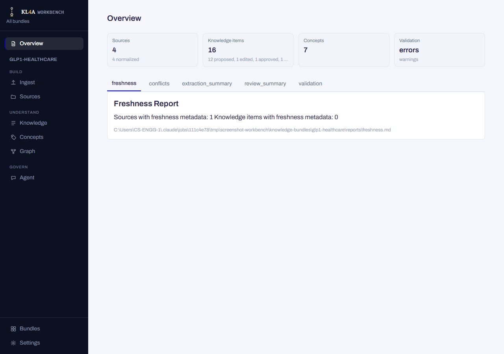

## Settings

Configuration for LLM providers and app-wide preferences — the one screen reachable without
any bundle open, since most of it isn't bundle-scoped.

- **Reviewer name** and **parallel LLM requests** (how many sections/sources are sent to the
  LLM at once during Normalize and Mine; default 6) — simple saved preferences.
- **Prompts reference** — read-only, shows the actual built-in prompt text used at each
  pipeline step.
- **Bundle prompt overrides** — per-bundle mining/chat prompt overrides; each shows the
  built-in default it would replace, and wins over a profile-level override when set.
- **LLM profiles** — create, edit, test, delete, and set a default among named provider
  profiles (base URL, model, auth, timeouts, reasoning effort, an API key field that's never
  pre-filled or shown unmasked, plus per-profile prompt overrides). A field currently
  overridden by an environment variable is shown dimmed with an explanation, since editing it
  here has no effect until that variable is unset.
- **MCP invocation** — the exact command to expose the current bundle over MCP to an external
  agent host, with a copy button, plus per-client auto-configuration for MCP-capable tools
  detected on the machine (backing up any existing config entry with the same name first) or
  a manual snippet for ones that aren't auto-detected.
- **Diagnostics** — exports a zip with app/OS info, the startup log, and a redacted settings
  summary for troubleshooting. It never includes API keys.

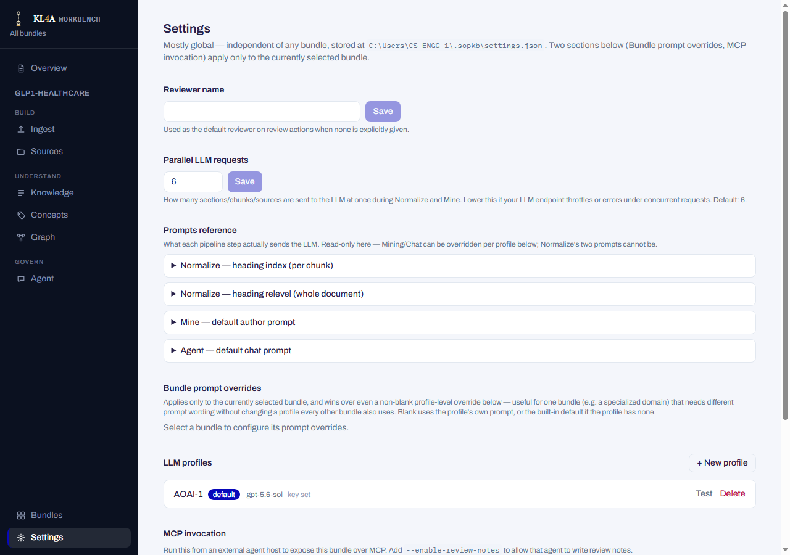

## Recovering from a broken workbench root

If the app can't open a workbench root at all — the folder was moved, deleted, or its
manifest is malformed — it shows a plain recovery screen instead of the sidebar and a broken
view: the actual error, a field to point at a different folder (**Switch**, or **Browse…**
for a native picker), and **Retry** to re-attempt the same root.

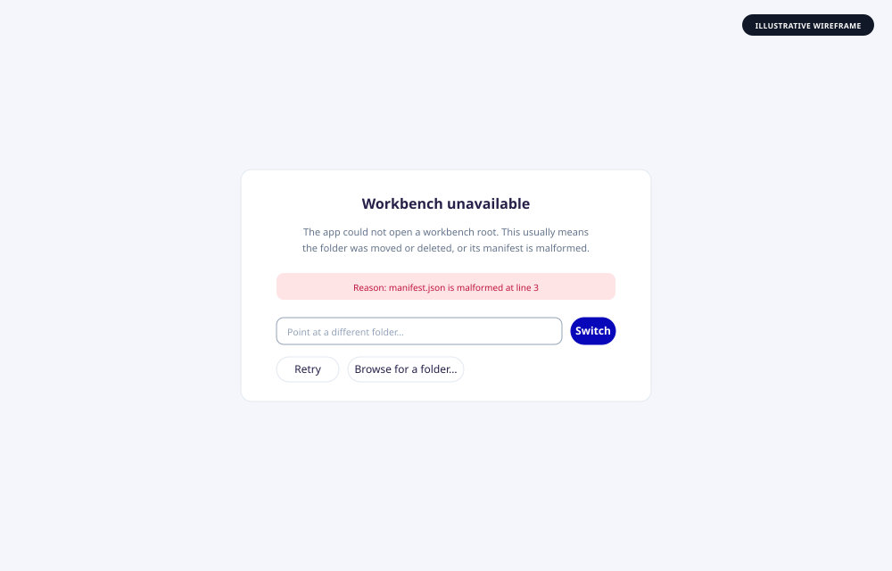
