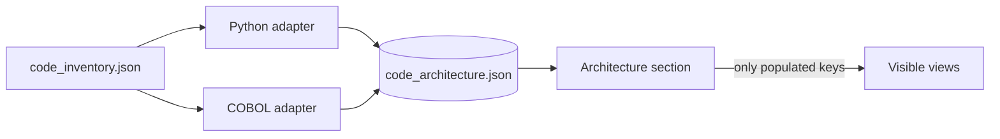

# Architecture Detection

Parsing gives you symbols and edges. Architecture detection gives you the
framework-level structure a developer actually navigates by — routes, models,
programs, copybooks — and it differs per language.

## The Adapter Contract

Detection runs per language and each adapter contributes its own views into one
shared state file, `code_architecture.json`. Each adapter owns:

- its **keys** in that file, namespaced so they cannot collide, and
- its **summary counts**, merged into the shared `summary` block.

CodeKB derives architecture results from whichever keys came back
populated. Nothing in the nav layer knows what a copybook or a router is — it only
knows which keys have data.

The consequence is the property worth having: **a repository is never offered a
view of another stack**, and never a view it cannot fill.



## Python

Detected from AST, for sources with `language: python`.

| View | Contains |
| --- | --- |
| **HTTP endpoints** | Routes from decorators, with method, effective path, handler and tags. Plus router wiring: prefix, whether it is actually mounted, endpoint count |
| **Database models** | SQLAlchemy declarative models — table name, bases, columns and relationships |
| **API schemas** | Pydantic request/response models, including transitively derived subclasses |
| **External packages** | Third-party imports, ranked by how many modules import them |

Effective path is mount prefix + router prefix + route path, so what is listed is
what a client would call.

!!! tip "Mounted: no"
    The router wiring table has a `Mounted` column. A router defined but never
    included is the quickest way to end up with routes that exist in the code and
    not in the running app.

Flask, Django, Click/argparse and Celery entrypoints are collected into the same
endpoint schema, so a repository that mixes them is not silently half-described.

## COBOL

Derived from relations the COBOL parser already emits — `imports`, `calls`,
`performs`, `reads`, `writes` — so this is a view over existing evidence rather
than a second parse.

| View | Contains |
| --- | --- |
| **Programs** | Each program's paragraphs, sections and data items, plus what it COPYs and CALLs |
| **Copybooks** | Fan-in: who copies each one, its field count, and whether it exists in the repository at all |
| **File I/O** | Each data file, and which programs read and write it |
| **External calls** | CALL targets the repository does not contain |

**Copybook fan-in is the direction that matters.** A copybook changed without
checking who copies it is the classic way to break a COBOL build, so the view is
built around who depends on it rather than what it contains. A copybook that is
COPYd but absent from the repository is listed too, rather than quietly omitted.

!!! note "No job-flow view"
    Job flow would require JCL, and nothing in the pipeline parses any. Rather
    than infer a flow from guesses, the view is absent. If you need it, it needs
    a JCL adapter first.

## When Nothing Is Detected

The **Architecture** section does not appear at all if no adapter populated
anything — the pipeline may simply not have been run with architecture enabled.
Re-run with **Detect architecture** on:

```bash
kl4a --use codekb architecture ./my-code-bundle
```

If the section appears but one view is missing, that view has no data: a repository
with no ORM models has no **Database models** tab, and that is the intended
behaviour rather than a failure.

## Adding An Adapter

To contribute views for another language:

1. Write a detector that takes sources, modules, symbols and relations, and
   returns namespaced keys plus a `summary` block.
2. Merge it in `code_architecture.py`, beside the existing adapters.
3. Register the `(mode, label, state key)` entries used by the architecture model.

Nothing else needs to change — the nav, the search bar, paging and the empty
states are all driven from the registry and the data.
