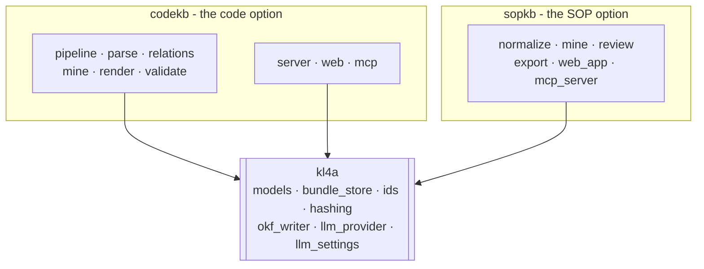

# codekb Architecture

`codekb` is a separate Python package from `sopkb` - its own import root, its own
console script, its own tests. Both ship inside the single `kl4a` PyPI
distribution and share one OKF core.

## Three packages, one core



**KL4A** is the product. `sopkb` and `codekb` are the two options it offers, and
`kl4a` is the shared substrate they build on. Neither option depends on the other,
so a code bundle never installs a document parser and a SOP bundle never installs a
code parser.

What `codekb` takes from the substrate:

| From `kl4a` | Used for |
| --- | --- |
| `bundle_store` | `load_manifest`, `utc_now`, `relative_to_bundle` |
| `ids` | `slugify` |
| `okf_writer` | `OKFDocument`, `OKFDocumentError` |
| `hashing` | `sha256_file` - source checksums |
| `llm_provider` | `parse_author_response` |
| `llm_settings` | provider resolution for hybrid mining, via `complete()` |

!!! note "Why the substrate is a package of its own"
    It started inside the SOP package, which meant installing `codekb` pulled in
    the whole SOP toolkit — `pdfplumber` and `python-docx` included — for six
    modules' worth of shared code. Extracting it made `codekb` installable on its
    own. That substrate now lives in `kl4a`, alongside the `kl4a --use TOOL ...`
    dispatcher and the `kl4a.sopkb`/`kl4a.codekb` import-aliasing
    shims — but the substrate itself carries no dependency beyond PyYAML; the
    dispatcher and aliasing layer add none of their own.

    The rule that keeps it honest: nothing profile-specific goes in the substrate.
    Document parsing belongs to `sopkb`, code parsing to `codekb`, and
    `tools/kl4a/tests/test_core_stands_alone.py` fails if either creeps back in.

## Module map

| Module | Responsibility |
| --- | --- |
| `model.py` | `CodeBundle` — reads `.codekb/code_*.json` and indexes it for lookup |
| `state.py` | Atomic state and manifest writes, and tolerant reads |
| `config.py` | Bundle config and the standard bundle location |
| `ids.py` | Stable identifiers for modules, symbols, evidence, relations |
| `bundle.py` | Create a bundle; write state and Markdown |
| `inventory.py` | Scan the repository into a source inventory |
| `parse.py` | Source files into modules and symbols with evidence |
| `relations.py` | Edges between symbols, and their resolution status |
| `architecture.py`, `entrypoints.py` | Framework detection |
| `knowledge.py`, `author.py` | Mining, static and LLM-assisted |
| `cache.py` | Enrichment cache for hybrid runs |
| `lifecycle.py` | Claim lifecycle across re-mines |
| `render.py` | The human-readable Markdown layer |
| `validate.py` | Bundle validation |
| `context.py` | Task-ready code context — the `codekb context` command reads through here |
| `agent.py` | The deterministic code-agent harness behind `codekb agent` |
| `canonical.py`, `trace.py`, `trace_validate.py`, `transform.py` | Cross-bundle migration |
| `pipeline.py`, `run_state.py` | End-to-end build, foreground and background |
| `adapters/` | Per-language adapters (COBOL today) |
| `mcp.py` | The read-only `code.*` MCP surface |
| `cli.py` | `codekb` |

## Concurrency: why codekb writes state itself

The pipeline can write state while other consumers read the same
`.codekb/code_*.json` files and `manifest.yaml`. A plain truncate-then-write
lets a reader observe an empty or partial document.

`state.py` writes to a sibling temp file and `os.replace`s it, so a reader sees
either the previous version or the new one, never a torn one. On Windows the
replace fails with `PermissionError` while another process holds the destination
open for reading, so it retries briefly; the write itself stays atomic. Reads are
also tolerant — an empty or corrupt file reads as "no state yet" rather than
raising.

This is why `codekb` does not simply call `kl4a.bundle_store.write_json` or
`.save_manifest`. codekb owns the background worker, so it owns the guarantee.
`save_manifest` is the more consequential of the two: codekb rewrites
`manifest.yaml` twice per run while the pipeline page re-renders every few
seconds, and the readers that load it swallow a parse error and fall back to
`{}`, so a torn manifest does not fail loudly — it silently renders a hybrid
bundle as `static` with a blank repository path. `state.save_manifest` writes the
same bytes as `kl4a`'s, through `write_text_atomic`.

## What lands on disk

```
my-code-bundle/
  manifest.yaml          profile: code-knowledge-bundle
  .codekb/                pipeline state, one file per stage
  code/                  rendered module and symbol pages
  reports/               validation, coverage, relation resolution
  overview.md            the human entry point
```

Each stage writes its own state file, so a run that fails partway leaves
everything the earlier stages produced. See [Bundle State](bundle-state.md).

## Where the boundary sits

- A **Code Knowledge Bundle** is an OKF bundle with
  `profile: code-knowledge-bundle`. The bundle model — sources, sections,
  knowledge items, evidence, relations — is shared with document bundles and
  specified in the [OKF Bundle Spec](../OKF_BUNDLE_SPEC.md).
- LLM provider settings are read from the same saved settings as `sopkb`, so
  configuring a provider once covers both.
