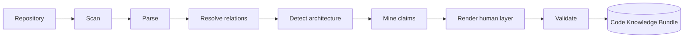

# Code Knowledge Bundles

Turn a source repository into knowledge an agent can act on — where every claim
points back at the code it came from.

A **Code Knowledge Bundle** is an [OKF](../OKF_BUNDLE_SPEC.md) bundle built from a
repository rather than from documents. `codekb` parses the repository, resolves the
relationships between its symbols, extracts claims about what the code does, and
records the exact source span behind each one.

The result is a folder you can commit, diff, and hand to an agent:

- Every claim traces back to the lines it was derived from.
- Nothing reaches an agent until the tier that needs review has been reviewed.
- Built on OKF's core model, so it is not a proprietary export format.

## What To Read First

| If you want to | Read |
| --- | --- |
| Build your first bundle | [Getting Started](getting-started.md) |
| Choose between static and hybrid mining | [Pipeline & Mining](pipeline.md) |
| Know what a claim is and when it counts | [Knowledge & Review](knowledge-and-review.md) |
| See what is detected for your stack | [Architecture Detection](architecture-detection.md) |
| Wire a bundle into an agent | [Agent Consumption](agent-consumption.md) |
| Expose a bundle over MCP | [MCP Server](mcp.md) |
| Know how the package is put together | [Architecture](architecture.md) |
| Look up a command | [CLI Reference](cli.md) |

## How A Bundle Is Built

Each stage writes its own state file under `.codekb/`, so a run that fails partway
leaves everything the earlier stages produced. See
[Bundle State](bundle-state.md).

## Where This Sits

**KL4A** is the product; `codekb` and `sopkb` are the two options it offers.
`codekb` is the code option: a repository in, grounded claims out. `sopkb` is the
SOP option — Word docs, PDFs and Markdown in — and has its own tab.

Both write OKF bundles over one shared core, gate retrieval behind human review,
and expose the result over a CLI and an MCP server. They differ
in what goes in and what gets extracted.

They are separate installable packages. See [Architecture](architecture.md).

### Languages

`codekb` parses **Python** and **COBOL**. Files in other languages are inventoried
and counted, so you can see what a repository contains, but they are not parsed
into modules, symbols and relations — nothing is claimed about them.

## What This Is Not

- **Not a code search tool.** Search exists, but the point is the reviewed claim
  layer on top of the parse, not the parse itself.
- **Not a linter or a static analyser.** Nothing here judges your code. It records
  what the code contains and what can be said about it with evidence.
- **Not a substitute for reading the code.** A bundle is a map. Every entry links
  to the territory.
