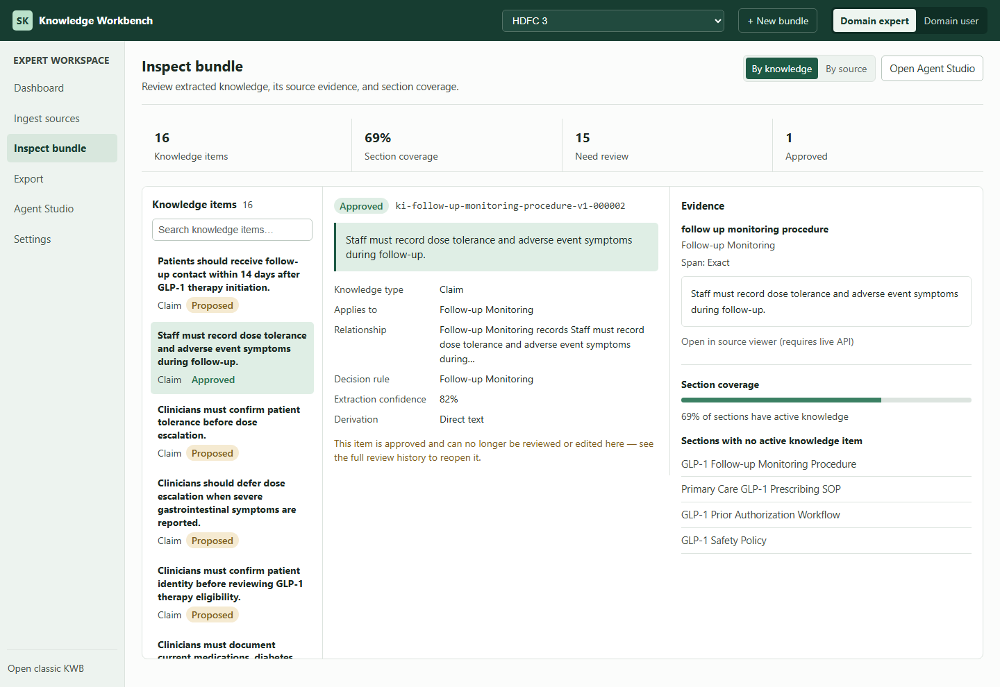
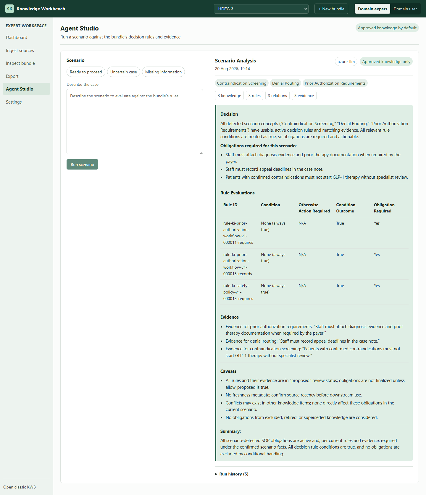

# KL4A

*Knowledge Layer For Agents — an independent open-source project.*

**Create OKF-compliant knowledge bundles from your SOP docs (`sopkb`) and your source code (`codekb`) — and enable your agents to use them.**

**[→ See KL4A in Action](see-kl4a-in-action.md)** — a real source, real commands, real
output, and a real agent answering a real question, in about five minutes.

Your organization's SOPs, policies, procedures, regulations, and standards live in Word
docs, PDFs, and wikis — written for humans, not for agents. KL4A reads them, proposes
structured knowledge, and puts a person in front of every claim before an agent can act
on it. What comes out the other side is a **Knowledge Bundle**:

- Every claim traces back to the exact source text it came from.
- Nothing an agent can act on until a person has reviewed it.
- Plain files, git-diffable, no lock-in — built on [OKF](https://github.com/GoogleCloudPlatform/knowledge-catalog/tree/main/okf), the open format this project implements. (KL4A is not affiliated with or endorsed by the OKF project.)

It doesn't claim to mine everything in a document — nothing becomes usable knowledge
until a person reviews it, which is exactly the point.

The same discipline applies to a source repository — see
**[Code Bundles](codekb/index.md)**.

**Ground it. Review it. Then trust it.**

## Built for knowledge engineers

KL4A is for the person who owns turning a folder of SOPs into something an agent can be
trusted against: ingest a document set, inspect what got extracted and why, work through
review until the bundle is clean, and hand it off — to an agent, an MCP server, or an
enterprise import.

You review the knowledge once, so you don't have to review every answer forever.

That review happens once, at authoring time, on a bounded set of extracted claims — not
at runtime, on every answer an agent gives. It's also usable without a knowledge
engineer in the room:

- **SOP & policy owners** see exactly what was extracted, verify it against source
  evidence, and approve, reject, or correct it — no CLI required.
- **Agent developers** search knowledge items, resolve citations, and retrieve
  source-grounded context locally, via CLI, MCP, or the bundle's plain files.

## What it does

- **Structure** — sources become OKF-native bundles agents can query directly.
- **Ground** — every claim keeps its exact source span, or is flagged when one can't be matched.
- **Review** — nothing becomes accepted knowledge until a person approves, rejects, defers, edits, or comments on it.
- **Consume** — agents query the bundle via CLI, agent chat, or MCP; export to Graph JSON or RDF/TTL when other tooling needs it.

## One product, two options

**KL4A** is the product. It offers two options over one shared OKF core — pick the
one that matches what you are grounding. Each runs independently — `sopkb`,
and `codekb` are each their own command and their own import — and both
ship together in the one `pip install kl4a`.

| | **sopkb** | **codekb** |
| --- | --- | --- |
| For | SOPs, policies, procedures, regulations | Source code |
| Input | Word docs, PDFs, Markdown | A source repository |
| Scope | — | Python and COBOL parsed; other languages inventoried, not parsed |
| Produces | Claims grounded in source text | Claims grounded in source spans, plus modules, symbols and relations |
| Uses an LLM | Optionally | Optionally, for hybrid mining |
| Start here | [Quickstart](sopkb/quickstart.md) | [Getting Started](codekb/getting-started.md) |

Both write OKF bundles and expose the result over a CLI and an MCP server.
They differ in what goes in and what gets extracted.

`sopkb` and `codekb` both gate retrieval behind human review, and each has a local
workbench.

## One package: `kl4a`

[`kl4a`](kl4a.md) is the one PyPI project this whole product publishes to —
`pip install kl4a` gets you the shared OKF core both options build on,
*and* `sopkb` and `codekb` themselves, in one install. Each keeps
its own console script and its own import root, so `sopkb ...` still works
exactly as before.

`kl4a` also adds an optional dispatcher over the two, so you don't have
to remember two command names or two import roots: `kl4a --use sopkb ...`
/ `kl4a --use codekb ...` on the command line,
`import kl4a.sopkb` / `kl4a.codekb` in code — each forwarding
to, or aliasing, the real installed package unchanged.

The dispatcher isn't a fourth option. It has no behavior beyond deciding which
of the two to call: same subcommands, same flags, same `--help`, same exit
codes, the same objects when imported. Skip it and run `sopkb`/`codekb`
directly if you'd rather — nothing about what they do changes either way.

**[→ kl4a: the unified CLI and library](kl4a.md)**

## Install, run, see output

!!! tip "No LLM, no API key, no network call"
    The `fixture` mining provider extracts obligation-shaped sentences
    ("must", "shall", "should record"...) with plain pattern matching, and
    it's the default — nothing below needs `azure-llm` or any credentials.

!!! note "KL4A is the product; `sopkb` is one of its two CLIs"
    KL4A ships as one PyPI project, `kl4a` — a single `pip install kl4a` gets
    you the shared substrate plus the `sopkb` and `codekb` packages
    and CLIs described above, all together. The distribution once named
    `kl4a` is now `sopkb`: naming one option after the whole product read
    wrong once the shared substrate needed a real name of its own, which is
    `kl4a` today. `kl4a` is not a fourth option and not that old renamed
    distribution — besides being the substrate the two options build on,
    it's also the dispatcher the commands below use (`kl4a --use sopkb ...`)
    and an import namespace (`kl4a.sopkb`) — see
    [kl4a: the unified CLI and library](kl4a.md). Every
    `kl4a --use sopkb <command>` below is `sopkb <command>` untouched — same
    flags, same output, same exit code — so `sopkb <command>` still works
    exactly as shown if you'd rather type that.

```bash
pip install kl4a
kl4a --use sopkb init demo-bundle
```

No server. No database. No LLM key required — that's the entire dependency footprint.

From there it's `scan` → `normalize` → `mine` → `review` → `validate` → `export` → `serve`,
each run the same way: `kl4a --use sopkb <command>`.

That ends with a local web app at `http://127.0.0.1:8765`: browse sources, review mined knowledge, chat with the in-browser agent. Here's the Inspect bundle screen, browsing by knowledge, on a GLP-1 healthcare SOP set — a proposed item with its evidence and review actions, next to an already-approved one:



And here's the payoff — Agent Studio actually consuming that knowledge to answer a scenario, with its detected concepts, retrieved-context counts, rule evaluations, and evidence shown alongside the answer:



**[→ Run the full walkthrough on the Quickstart page](sopkb/quickstart.md)** — every command, expected output at each step, a CLI example of an agent retrieving grounded context, and a second tutorial using a richer DOCX/PDF reference bundle.

## Reference bundle

A synthetic, fully worked GLP-1 healthcare example lives at [`examples/glp1-healthcare`](../examples/glp1-healthcare). It includes:

- Multiple SOP-like sources, with DOCX/PDF ingestion
- Evidence-backed proposed knowledge
- Persisted human-in-the-loop review states
- Conflict and freshness reports
- OKF, Graph JSON, and RDF exports

## Where this fits

!!! info "Free and complete on its own"
    KL4A handles extraction, evidence grounding, and human review. Free. Local-first.
    Yours to run anywhere, forever.

    Deterministic enforcement, cross-bundle reasoning, audit trails, and governed
    multi-tenant operation in production are a separate, deliberately out-of-scope
    concern — a downstream layer this project doesn't try to be. KL4A is a tool for the
    layer where ontology projects actually fail — this is how your SOPs get ready for
    that layer, whether or not you ever adopt anything downstream of it.
    See [WHY_OPEN_CORE.md](WHY_OPEN_CORE.md) for exactly where that line sits, why, and
    who maintains this project.

## Guides

- **[Why This Exists](WHY.md)** — why KL4A exists and why it's open.
- **[Quickstart](sopkb/quickstart.md)** — step-by-step install and first bundle, with expected output.
- **[Desktop UI Guide](sopkb/DESKTOP_UI_GUIDE.md)** — the desktop app, screen by screen.
- **[MCP Server](sopkb/MCP_SERVER.md)** — connecting an agent to a bundle you've built.
- **[Architecture](sopkb/ARCHITECTURE.md)** — how the pieces fit together.
- **[FAQ](sopkb/FAQ.md)** — common setup and ingestion problems.

Everything above is `sopkb`. The other option has its own tab:
**[codekb](codekb/index.md)** for a source repository.

## Project

- **[Contributing](../CONTRIBUTING.md)** — dev setup, tests, PR process, DCO sign-off.
- **[Governance](../GOVERNANCE.md)** — project governance and the open-source/enterprise boundary.
- **[Roadmap](../ROADMAP.md)** — where the project is headed.
- **[License](../LICENSE)** — Apache-2.0.
- **[GitHub repository](https://github.com/CogniSwitch/Knowledge-Workbench)**

---

*KL4A · Apache-2.0 · [maintainers & boundary](WHY_OPEN_CORE.md)*
