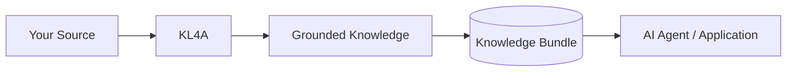
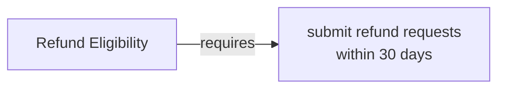
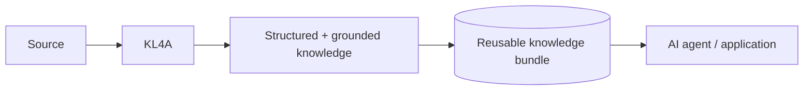
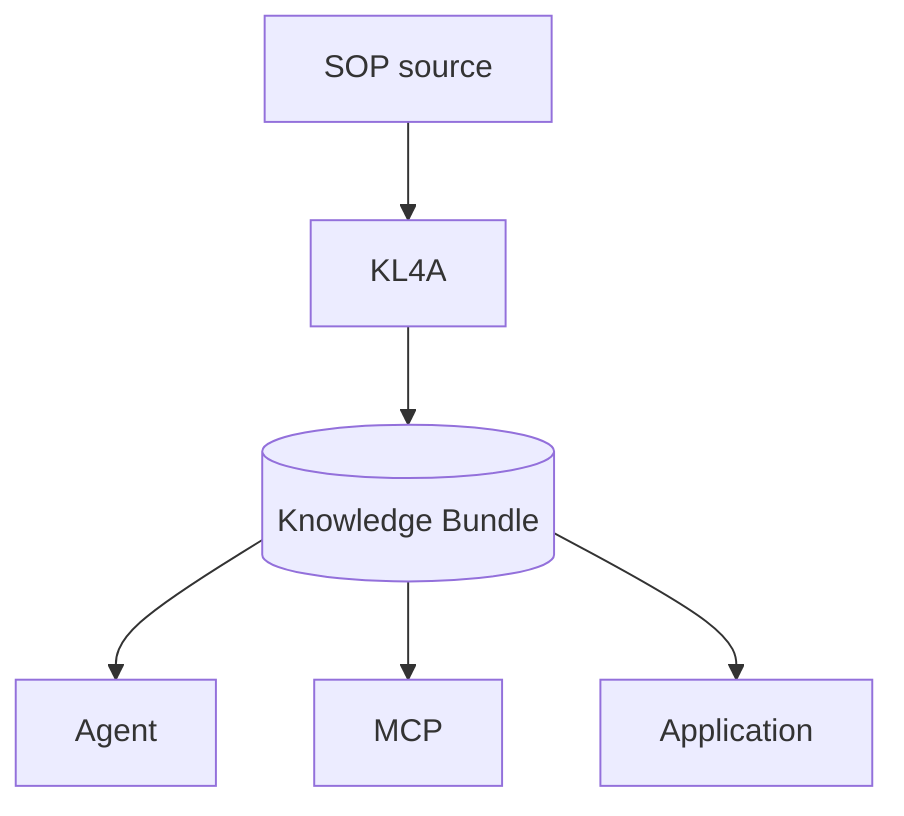
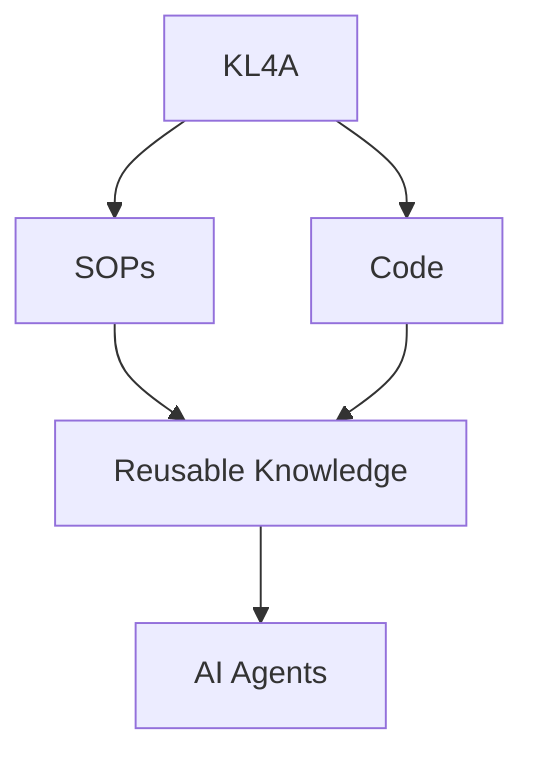
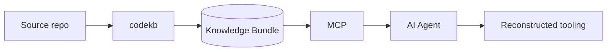

# See KL4A in Action

Turn an organizational source into reusable knowledge for AI agents.



Follow one real example below. Every command uses the `kl4a --use <tool>` dispatcher —
one command style across all three tools — and every piece of output is real, captured
by actually running it, not written to look good.

---

## 1. Start with the source

```markdown
# Customer Refund Policy

## Refund Eligibility

Customers must submit refund requests within 30 days of purchase.

Digital products must not have been downloaded to qualify for a refund.

## Refund Approval

Refund requests above $1,000 must receive finance approval before processing.
```

This is the kind of thing an organization already has — a policy document nobody has
turned into something an agent can query safely. ([Full source](../examples/customer-refund-policy))

## 2. Run KL4A

```console
$ kl4a --use sopkb init demo-bundle --title "Customer Refund Policy"
Initialized bundle bundle

$ kl4a --use sopkb scan --bundle demo-bundle sources
Scanned 1 source(s)

$ kl4a --use sopkb normalize demo-bundle
Normalized 3 section(s)

$ kl4a --use sopkb mine demo-bundle --provider fixture
Mined 3 proposed knowledge item(s)

$ kl4a --use sopkb validate demo-bundle
Validation completed with 0 error(s), 0 warning(s)
```

No API key, no network call — `--provider fixture` is zero-dependency and deterministic.

## 3. See the generated knowledge

One real mined item, exactly as produced:

```json
{
  "id": "ki-refund-policy-v1-000001",
  "subject": "Refund Eligibility",
  "predicate": "requires",
  "object": "Customers must submit refund requests within 30 days of purchase.",
  "confidence": 0.82,
  "review_status": "proposed",
  "span_status": "exact"
}
```



## 4. See where it came from

!!! success "Grounded — not a page reference, a checkable span"
    ```markdown
    ## Evidence Span

    > Customers must submit refund requests within 30 days of purchase.

    Source: refund-policy.md, section "Refund Eligibility"
    Character span: 49–114, span_status: exact
    ```

Every knowledge item keeps this exact relationship to the source text it came from.
That's what makes a bundle inspectable and reviewable, rather than a black box.

## 5. Give the knowledge to an AI agent

**Question:** *Can a customer request a refund after 20 days?*

**Knowledge retrieved by KL4A:**

```console
$ kl4a --use sopkb knowledge search demo-bundle "refund"
```

```json
{
  "subject": "Refund Eligibility",
  "predicate": "requires",
  "object": "Customers must submit refund requests within 30 days of purchase.",
  "evidence": "Customers must submit refund requests within 30 days of purchase."
}
```

**Agent answer:** Yes — the policy allows refund requests within 30 days of purchase,
so a request after 20 days is still within the window.

!!! info "Technical note"
    KL4A provides the grounded knowledge; the agent provides the reasoning. `sopkb`
    retrieves the relevant knowledge and evidence, while an MCP-capable agent can use
    that context to answer questions or perform downstream tasks.

### What just happened?

KL4A did not simply answer a question from the source document. It converted the
source into structured, reviewable knowledge with traceable evidence, packaged that
knowledge as a reusable bundle, and provided grounded context that an agent can use.



## 6. Why the knowledge bundle matters

KL4A doesn't just return an answer. It produces a knowledge bundle.



```console
$ kl4a --use sopkb bundle describe demo-bundle
{"id": "bundle", "knowledge_item_count": 3, "source_count": 1,
 "profile": "sop-knowledge-bundle", "status": "draft",
 "title": "Customer Refund Policy"}
```

The bundle is plain files on disk — storable, versionable, diffable in git, shareable —
usable by an agent, an MCP server, or an application independently of the extraction
run that produced it.

!!! question "Why not just use RAG?"
    A RAG pipeline can retrieve the right chunk too — that's not the difference. See
    **[Beyond Retrieval: what KL4A adds to RAG](sopkb/rag-comparison.md)** for an honest,
    real-output comparison of what each approach returns once it does.

## 7. One knowledge layer, two sources

The same knowledge-layer approach applies to the other information your agents already
need to work with:



| Source | Tool | Result |
|---|---|---|
| SOPs, policies, procedures | `sopkb` | Process/policy knowledge |
| Source repositories | `codekb` | Code knowledge |

**Code.** Turn a repository into structured code knowledge that an agent can query.

```console
$ kl4a --use codekb build python_simple_repo --bundle demo-bundle --mining static
Built code bundle at demo-bundle
  4 source(s), 3 module(s), 11 symbol(s), 43 relation(s)
  17 knowledge item(s), 8 awaiting review
```

One real mined claim: a function that raises `ValueError` on missing confirmation, with
the claim traced to the exact line that raises it. See
[Agent Consumption](codekb/agent-consumption.md) for the full picture.

## 8. Try it yourself

```bash
cd kl4a-rs && cargo build -p kl4a

./target/debug/kl4a --use sopkb init demo-bundle --title "Customer Refund Policy"
./target/debug/kl4a --use sopkb scan --bundle demo-bundle ../examples/customer-refund-policy/sources
./target/debug/kl4a --use sopkb normalize demo-bundle
./target/debug/kl4a --use sopkb mine demo-bundle --provider fixture
./target/debug/kl4a --use sopkb validate demo-bundle
./target/debug/kl4a --use sopkb knowledge search demo-bundle "refund"
```

**Expected result:** a knowledge bundle under `demo-bundle/` you can open, review, and
query — the same one this page's output came from.

## Technical example: a richer, multi-document SOP set

The [GLP-1 healthcare reference bundle](../examples/glp1-healthcare) exercises the same
pipeline against 4 real source documents (2 Markdown, 1 DOCX, 1 PDF) with pre-defined
agent tasks, conflict/freshness reporting, and full OKF/graph/RDF export.

```console
$ kl4a --use sopkb mine demo-bundle --provider fixture
Mined 12 proposed knowledge item(s)
```

!!! note "A real limitation, shown rather than hidden"
    One of the 4 real source files is a PDF, and it failed to normalize in this run —
    `follow-up-monitoring-procedure-e25874854706: normalization failed: couldn't parse
    input: invalid file trailer`, a real parser limitation reported as a validation
    warning, not silently dropped. The 12 knowledge items above came from the other 3
    sources. This is what actually happened, not a cleaned-up version of it.

Querying one of its pre-defined tasks:

```console
$ kl4a --use sopkb agent context demo-bundle --task eligibility-check
```

```json
{
  "task": {"id": "eligibility-check", "query_terms": ["eligibility", "identity", "contraindication", "clinical review"]},
  "usable_knowledge": [
    {"subject": "Intake Requirements", "predicate": "requires",
     "object": "Clinicians must confirm patient identity before reviewing GLP-1 therapy eligibility.",
     "confidence": 0.82}
  ]
}
```

## Experiment: agent-driven reconstruction via MCP

!!! warning "Experiment, not the primary use case"
    This repository's own `codekb` bundles were used, through MCP, to drive and
    verify an AI-assisted Rust reimplementation of parts of this same toolkit — see
    [Rust Port Parity](codekb/rust-port-parity.md). That is **a demonstration of what a
    code knowledge bundle enables an agent to do.**



A code knowledge bundle gives an agent working in an unfamiliar or
actively-changing codebase grounded symbols, relations, and evidence instead of raw
grep — which is exactly what made it possible to audit an experimental reimplementation
against the real thing, symbol-count by symbol-count, rather than eyeballing a diff.
