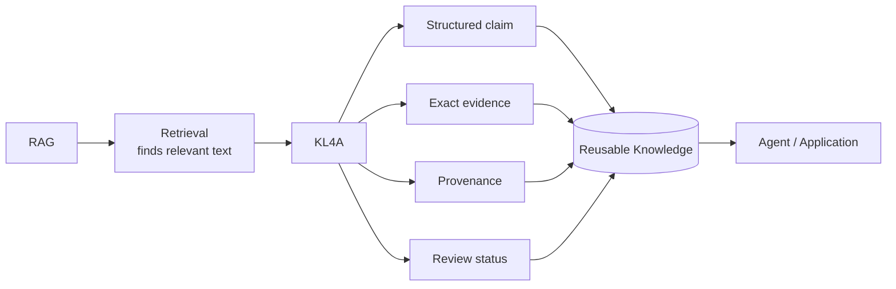

# Beyond Retrieval: what KL4A adds to RAG

This is not a claim that KL4A retrieves better than RAG. In the tests below, both
approaches usually find the right information — including in the one case built
specifically to try to break retrieval. **The difference is what happens *after*
retrieval:** KL4A represents each fact as **a structured claim with exact evidence and a
trackable review status**, instead of a chunk of prose with a similarity score attached.



## The difference in one example

**Question:** *"Can a customer request a refund after 20 days?"*

Both systems find the answer: **yes**. But what comes back is different.

**Baseline RAG** returns a chunk:

```text
Customers must submit refund requests within 30 days of purchase.

Digital products must not have been downloaded to qualify for a refund.
```

**KL4A / `sopkb`** returns a claim:

```text
Claim:     Refund Eligibility --requires--> "Customers must submit refund
           requests within 30 days of purchase."
Evidence:  "Customers must submit refund requests within 30 days of purchase."
Review:    proposed
```

Both retrieved the right fact. **KL4A makes the fact independently addressable, traceable,
and reviewable.** The full, real command output behind this example is in
[Case 1](#case-1-a-small-simple-document) below.

## Technical comparison: sopkb vs. a minimal baseline RAG

Date: 2026-10-07

- **Type**: a small, honest exploratory test — not a rigorous or statistically meaningful
  benchmark (three documents, three questions, one baseline implementation)
- **Goal**: see what a minimal "embed and retrieve" RAG pipeline actually returns, side by
  side with `sopkb`, on the same real source and the same real question
- **Source for this test**: [`benchmarks/rag-vs-kl4a`](../../benchmarks/rag-vs-kl4a) in
  this repository — the script and its real, captured output

The rest of this page exists to be honest about what grounding adds and where it doesn't
matter, not to claim `sopkb` "beats" RAG at retrieval — across all three cases below,
top-1 retrieval was correct on both sides, including the case built specifically to try
to break it.

!!! tip "The short version"
    Top-1 retrieval wasn't the gap in any of the three tests below. The gap is in what
    comes back once it's found, and — on content engineered to be confusing — in how thin
    the margin is between the right answer and a near-identical wrong one:

    | | Baseline RAG | `sopkb` |
    | --- | --- | --- |
    | Returns | A whole chunk — 2-3 sentences blended together | The one exact sentence the claim came from |
    | Knowledge status | A distance/similarity score with no fixed meaning | Explicit review state — proposed, approved, or rejected |
    | Shape | Raw text | A structured claim: `subject` / `predicate` / `object` |
    | If a chunk mixes 2 unrelated rules | The retrieval result does not provide sentence-level attribution; that has to be handled separately | Each rule is its own independently evidenced item |
    | Near-duplicate content nearby (Case 3) | Right answer wins, but by a thin margin — both chunks often ride along in a top-k context window | Exact match for a precise query; no ranking at all for a vague one |

    **A RAG chunk may contain multiple facts because the retrieval unit and the evidence
    unit are often the same.** `sopkb` separates those concerns: **each knowledge item is
    independently addressable and tied to its source evidence.** Neither approach is a
    clean win across the board, and this page says so at every step, not just here.

## Case 1: a small, simple document

### Setup

**Source:** [`examples/customer-refund-policy/sources/refund-policy.md`](../../examples/customer-refund-policy)
— a real, three-sentence, two-section policy document.

**Question:** *"Can a customer request a refund after 20 days?"*

**Baseline RAG:** [`chromadb`](https://www.trychroma.com/) with its default local embedding
function (`all-MiniLM-L6-v2`, run via ONNX — no API key, no network call at query time).
The source was chunked by `##` section (2 chunks: "Refund Eligibility", "Refund
Approval"), embedded, and queried for the top matches.

**`sopkb`:** the same source, already built into a real bundle at
[`examples/customer-refund-policy/bundle`](../../examples/customer-refund-policy), queried
with `kl4a --use sopkb knowledge search`.

### What each side actually returned

**Baseline RAG** — real output from `benchmarks/rag-vs-kl4a/compare.py`:

```
=== Query: 'Can a customer request a refund after 20 days?' ===
  #1 chunk-0  distance=0.6761  similarity~=0.3239
      'Refund Eligibility\n\nCustomers must submit refund requests within 30 days of purchase.\n\nDigital products must not have been downloaded to qualify for a refund.'
  #2 chunk-1  distance=1.1397  similarity~=-0.1397
      'Refund Approval\n\nRefund requests above $1,000 must receive finance approval before processing.'
```

**`sopkb`** — real output, same source, same underlying fact:

```console
$ kl4a --use sopkb knowledge search examples/customer-refund-policy/bundle "refund"
```

```json
{
  "evidence": "Customers must submit refund requests within 30 days of purchase.",
  "id": "ki-refund-policy-v1-000001",
  "object": "Customers must submit refund requests within 30 days of purchase.",
  "predicate": "requires",
  "review_status": "proposed",
  "section_id": "section-refund-policy-002",
  "source_id": "refund-policy",
  "subject": "Refund Eligibility"
}
```

### Honest comparison

| | Baseline RAG | `sopkb` |
| --- | --- | --- |
| Retrieved the right chunk/fact? | Yes — top hit was the correct section | Yes |
| Exact evidence span? | No — returns the whole chunk (both sentences, blobbed together) | Yes — `evidence` is the single exact sentence |
| Review/approval status? | None | `review_status: "proposed"` — a reviewable, trackable field |
| Structured claim? | No — raw text only | Yes — `subject` / `predicate` / `object` |
| Knowledge status | A distance score (0.676), with no fixed meaning on its own | N/A — explicit knowledge status, not a retrieval ranking signal |

### Takeaway

Retrieval was fine on both sides — not the story here. **The story is the chunk itself:**
baseline RAG blends "must submit within 30 days" and "must not have been downloaded" into
one blob, with no way to cite either alone. `sopkb` keeps them as **two separate,
independently reviewable items.**

On a 3-sentence document, that barely matters. Case 2 moves to a messier one to find out
if it does.

## Case 2: a longer, messier document

### Setup

**Source:** [`examples/customer-support-policy/sources/support-policy.md`](../../examples/customer-support-policy)
— a real, 8-section returns policy with cross-references between sections and exceptions
that override the general rule (electronics get a shorter return window; exchanges get a
restocking-fee waiver that the base condition rule doesn't mention).

**Question:** *"If I reported a damaged item 3 days after delivery and want to exchange it
for a different size, do I owe a restocking fee?"* — deliberately cross-cutting: answering
it correctly means combining the damaged-item rule (Section 5), the restocking fee rule
(Section 2), and the exchange fee waiver (Section 7).

**Baseline RAG:** same method as Case 1 — `chromadb`, default local ONNX MiniLM embedding,
chunked by `##` section (8 chunks this time), top-4 retrieved.

**`sopkb`:** the same source, built into a real bundle at
[`examples/customer-support-policy/bundle`](../../examples/customer-support-policy)
(18 proposed knowledge items, 0 errors, 0 warnings), queried with
`kl4a --use sopkb knowledge search` for the terms a person would actually search:
"restocking", "exchange", "damaged".

### What each side actually returned

**Baseline RAG** — real output from `benchmarks/rag-vs-kl4a/compare_support_policy.py`:

```
=== Query: 'If I reported a damaged item 3 days after delivery and want to exchange it for a different size, do I owe a restocking fee?' ===
  #1 chunk-4  distance=0.6913  similarity~=0.3087
      '5. Damaged or Defective Items\n\nCustomers must report damaged or defective items within 48 hours of delivery to qualify for a free replacement or full refund including return shipping costs. Reports made after 48 hours must be handled under the general return window described in Section 1, with return shipping paid by the customer.'
  #2 chunk-6  distance=0.7676  similarity~=0.2324
      '7. Exchanges\n\nStaff must waive the restocking fee described in Section 2 for exchanges of the same item in a different size or color, provided the request is made within the general return window described in Section 1. Exchanges for a different product entirely must be processed as a return followed by a new purchase.'
  #3 chunk-1  distance=0.9486  similarity~=0.0514
      '2. Condition Requirements\n\nReturned items must be unused, in their original packaging, and must include all accessories and manuals. Staff must apply a 15% restocking fee to items missing original packaging. Items showing signs of use must not be accepted for return under this policy.'
  #4 chunk-5  distance=1.0393  similarity~=-0.0393
      '6. Refund Processing\n\nStaff must issue approved refunds to the original payment method within 5-7 business days of the returned item being received and inspected. Store credit issued under Section 1 must not expire and may be combined with future promotional discounts.'
```

**`sopkb`** — real output, same source, same question's component facts:

```console
$ kl4a --use sopkb knowledge search examples/customer-support-policy/bundle "restocking"
```

```json
[
  {
    "evidence": "Staff must apply a 15% restocking fee to items missing original packaging.",
    "id": "ki-support-policy-v1-000005",
    "subject": "2. Condition Requirements",
    "predicate": "requires",
    "review_status": "proposed"
  },
  {
    "evidence": "Staff must waive the restocking fee described in Section 2 for exchanges of the same item in a different size or color, provided the request is made within the general return window described in Section 1.",
    "id": "ki-support-policy-v1-000015",
    "subject": "7. Exchanges",
    "predicate": "requires",
    "review_status": "proposed"
  }
]
```

```console
$ kl4a --use sopkb knowledge search examples/customer-support-policy/bundle "damaged"
```

```json
[
  {
    "evidence": "Customers must report damaged or defective items within 48 hours of delivery to qualify for a free replacement or full refund including return shipping costs.",
    "id": "ki-support-policy-v1-000011",
    "subject": "5. Damaged or Defective Items"
  },
  {
    "evidence": "Reports made after 48 hours must be handled under the general return window described in Section 1, with return shipping paid by the customer.",
    "id": "ki-support-policy-v1-000012",
    "subject": "5. Damaged or Defective Items"
  }
]
```

(fields trimmed above for length; the full, real output also includes `object`, `rule_ids`,
`section_id`, and `source_id` on every item, as in Case 1.)

The four returned items provide the facts needed for the reasoning chain; `sopkb` does not
perform the chain itself — see the "Honest limit" box below.

### Honest comparison

Retrieval accuracy was good on both sides — baseline RAG's top 3 hits (`chunk-4`,
`chunk-6`, `chunk-1`) are exactly the 3 sections the question depends on. No retrieval win
to claim here, and this page isn't claiming one.

| | Baseline RAG chunk | What it bundles together | `sopkb` items |
| --- | --- | --- | --- |
| `chunk-4` | "Damaged or Defective Items" | The "report within 48h" rule **+** the separate "after 48h" rule | `000011`, `000012` — kept separate |
| `chunk-6` | "Exchanges" | The fee-waiver rule **+** an unrelated rule about product-swap exchanges | `000015` — standalone |
| `chunk-1` | "Condition Requirements" | The restocking-fee rule **+** unrelated packaging/condition rules | `000005` — standalone |

Each `sopkb` item carries its own evidence span and `review_status`; reading any one of the
three RAG chunks instead means re-parsing which sentence inside it answers which part of
the question, with nothing marking that boundary.

!!! warning "Honest limit on sopkb's side"
    `knowledge search` doesn't synthesize the final answer either. It won't chain
    "damaged-item report after 48h → falls under the general window → exchange for a
    different size → fee waived" into one conclusion on its own — that reasoning still
    happens downstream, in an agent or a person, same as with RAG's chunks. What changes is
    the material that reasoning starts from: four precise, checkable facts instead of three
    chunks of partially-relevant, un-cited prose.

### Takeaway

Same gap as Case 1, sharper: chunked retrieval finds the right sections fine, even here.
**What it doesn't give you is a way to point at the exact sentence behind each part of an
answer, or to know whether that sentence has been reviewed.** That holds on both documents
— this page isn't claiming RAG retrieval fails, only that it doesn't ground.

## Case 3: near-duplicate content

### Setup

**Source:** [`examples/category-returns-policy/sources/category-policy.md`](../../examples/category-returns-policy)
— a real, 12-section document.

- Every section uses the same sentence template (return window, restocking fee, warranty
  length), differing only in the category name and three numbers.
- That deliberately creates **near-duplicate chunks** — a known real weakness of small
  embedding models, since the similarity margin between the right chunk and its nearest
  wrong neighbor can be thin.

**Question:** *"What is the restocking fee percentage for Major Appliances returned
without original packaging?"*

- Correct answer: **20%**
- Confusable neighbor: "Small Appliances" at **10%**, with nearly identical surrounding
  sentence structure.

**Baseline RAG:** `chromadb`, default local ONNX MiniLM embedding (same method as Cases
1–2), chunked by `##` section (12 chunks), top-4 retrieved.

**`sopkb`:** the same source, built into a real bundle at
[`examples/category-returns-policy/bundle`](../../examples/category-returns-policy)
(24 proposed knowledge items, 0 errors, 0 warnings), queried with `kl4a --use sopkb
knowledge search`.

### What each side actually returned

**Baseline RAG** — real output from `benchmarks/rag-vs-kl4a/compare_category_policy.py`:

```
=== Query: 'What is the restocking fee percentage for Major Appliances returned without original packaging?' ===
  #1 chunk-1  distance=0.8295  similarity~=0.1705
      '2. Major Appliances\n\nMajor Appliances must be returned within 45 days of delivery to qualify for a refund. Major Appliances must include original packaging and all accessories to avoid a 20% restocking fee. Major Appliances carry a 24-month manufacturer warranty administered directly by the manufacturer.'
  #2 chunk-0  distance=0.9447  similarity~=0.0553
      '1. Small Appliances\n\nSmall Appliances must be returned within 21 days of delivery to qualify for a refund. Small Appliances must include original packaging and all accessories to avoid a 10% restocking fee. Small Appliances carry a 12-month manufacturer warranty administered directly by the manufacturer.'
  #3 chunk-11  distance=1.2678  similarity~=-0.2678
      '12. Tablet Devices\n\n...'
  #4 chunk-10  distance=1.2912  similarity~=-0.2912
      '11. Mobile Phones\n\n...'
```

**`sopkb`** with a precise query — real output:

```console
$ kl4a --use sopkb knowledge search examples/category-returns-policy/bundle "Major Appliances restocking"
```

```json
[
  {
    "evidence": "Major Appliances must include original packaging and all accessories to avoid a 20% restocking fee.",
    "id": "ki-category-policy-v1-000004",
    "subject": "2. Major Appliances",
    "predicate": "requires",
    "review_status": "proposed"
  }
]
```

**`sopkb`** with a vague query — real output (not cherry-picked; run to check the other
direction honestly):

```console
$ kl4a --use sopkb knowledge search examples/category-returns-policy/bundle "restocking"
```

Returns all 12 category items, one per section, unranked — every section mentions a
restocking fee, so a one-word lexical query matches all of them equally.

### Honest comparison

**This test did not produce the dramatic "RAG fails miserably" result it was built to
look for.** Baseline RAG's top-1 hit was correct: Major Appliances, 20%. Reporting that
plainly rather than reaching for a different query until something broke.

What the test did surface, honestly, is more subtle and cuts both ways:

| | Baseline RAG | `sopkb` |
| --- | --- | --- |
| Precise query, top-1 result | Correct (Major Appliances, 20%) | Correct (Major Appliances, 20%) |
| Margin over the wrong neighbor | Thin — similarity 0.17 vs. 0.06 for "Small Appliances," on a scale where the #3/#4 results are already negative | N/A — lexical match either matches "Major Appliances" or it doesn't |
| Vague query (just "restocking") | Still ranks Major Appliances #1 (same ranking as above; the query didn't change) | Returns all 12 items with no ranking at all — the fixture provider does substring matching, not relevance scoring |

The issue surfaced by Case 3 is not top-1 retrieval accuracy — top-1 was right on both
sides. It is what happens when multiple near-duplicate results are passed together into
the downstream context: if an agent is handed both chunk-1 (20%) and chunk-0 (10%) because
top-4 chunks get stuffed into a prompt, and the two read almost identically, there is a
real, concrete opportunity for the answer to cite the wrong number. `sopkb`'s exact
evidence span doesn't have that failure mode *for a precise query* — but a vague query
exposes a different, equally real gap: no ranking signal whatsoever once more than one item
matches.

### Takeaway

Honestly: this test didn't catch RAG "failing miserably." **Top-1 retrieval was correct in
the one case engineered to break it.**

**What it did catch is a real, narrower risk:**

- **RAG's risk** — near-duplicate chunks sit close together in similarity space. A pipeline
  that feeds multiple top-k chunks to an LLM (the common real-world pattern, not just
  top-1) hands it two near-identical blobs differing only in a number, with nothing
  forcing the model to pick the right one.
- **KL4A's trade-off** — evidence-level grounding avoids that specific failure mode
  *when the query is precise*, but doesn't automatically out-rank a flood of
  equally-matching items *when it isn't*.

**Precision of the query matters to both approaches — just in different ways.**

## What this experiment actually demonstrates

This experiment does not establish that KL4A retrieves better than RAG. It demonstrates a
different distinction:

- **Retrieval** finds relevant source material.
- **KL4A** turns that source material into individually addressable knowledge — with
  evidence and a review state attached.

An agent can then reason over that knowledge just as it can reason over retrieved RAG
context — the knowledge is just **easier to check, cite, and trust before it acts.**

**Why that matters:** an agent that acts on what it retrieves — approving a refund, telling
a customer what's covered, answering a compliance question — is making a decision, not just
answering a trivia prompt.

- **Check** — a person can see exactly which sentence a claim came from, not just which chunk.
- **Cite** — the agent's answer can point to that exact sentence, instead of a paragraph
  that may or may not actually say it.
- **Trust** — the agent is acting on a claim a person has already reviewed, not on whatever
  the retriever ranked highest this time.

None of that prevents a bad outcome by itself — but it's the difference between a wrong
answer being traceable to one exact sentence versus traceable to nothing at all.

## Limitations of this test

- **Three documents, three questions.** This is not a benchmark suite — see
  [Quality Benchmark](../codekb/benchmark-external-backend.md) for what a more rigorous
  evaluation looks like for `codekb`.
- **A minimal baseline.** No reranking, no hybrid (lexical + semantic) search, no
  query rewriting — the kind of techniques a production RAG system would add. This tests
  the simplest version of "embed and retrieve," not the best one achievable.
- **No answer synthesis on either side.** Neither the baseline RAG nor `sopkb`'s
  `knowledge search` generates a final natural-language answer — both return material for
  an agent (or a person) to reason over, not a conclusion.
- **`codekb` wasn't tested here.** This page covers `sopkb` only.

## Reproduce it

```bash
cd benchmarks/rag-vs-kl4a
pip install chromadb
python compare.py                     # Case 1: customer-refund-policy
python compare_support_policy.py      # Case 2: customer-support-policy
python compare_category_policy.py     # Case 3: category-returns-policy
```

The full scripts and raw results are at
[`benchmarks/rag-vs-kl4a`](../../benchmarks/rag-vs-kl4a).

??? note "Reproducing the comparison in Rust (technical detail)"
    A Rust equivalent lives at
    [`benchmarks/rag-vs-kl4a-rs`](../../benchmarks/rag-vs-kl4a-rs):

    ```bash
    cd benchmarks/rag-vs-kl4a-rs
    cargo build --release
    ./target/release/rag-vs-kl4a-rs case1   # Case 1: customer-refund-policy
    ./target/release/rag-vs-kl4a-rs case2   # Case 2: customer-support-policy
    ```

    **Why it uses a different embedding method:** the plan was `fastembed` (the same ONNX
    MiniLM model family `chromadb` uses by default), for a direct apples-to-apples
    comparison. That didn't work on this machine: `ort` (the ONNX Runtime bindings Rust
    embedding crates depend on) only ships prebuilt binaries for the MSVC target, and this
    machine's Rust toolchain is `x86_64-pc-windows-gnu` — installing Visual Studio Build
    Tools just for a benchmark script wasn't worth the footprint. The Rust version uses
    dependency-free TF-IDF + cosine similarity instead: still "lite" (no model download,
    fully offline, no API key), but lexical rather than neural.

    **What that substitution changed, honestly:**

    | | TF-IDF (Rust) | Neural (Python) |
    | --- | --- | --- |
    | Case 1 — simple document | Same ranking as the neural version | Same ranking |
    | Case 2 — cross-cutting question | Ranked `chunk-0` ("General Return Window," **not relevant**) above `chunk-4` ("Damaged Items," relevant) — matched on shared words like "return," "days," "delivery" | Top-3 were exactly the 3 relevant sections |

    Not a knock on either language — a reminder that "a lite embedding store" isn't one
    fixed thing, and the embedding method matters at least as much as the retrieval
    plumbing around it.
